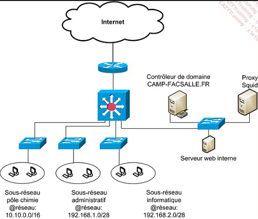

## Mini projet squid

### Présentation de l'infrastructure.
Soit le schéma d'architecture réseau suivant : 
.

Trois sous-réseaux sont définis pour les stations clientes. Les serveurs sont dans leur propre sous-réseau ayant pour adresse 172.16.0.0 et le proxy possède l’adresse 172.16.1.12. Le routage entre ces sous-réseaux se fait par un commutateur de niveau 3.
On désire que le sous-réseau administratif puisse avoir accès au serveur proxy aux heures de bureau (plage horaire allant de 7h30 à 19h30). Les clients du pôle chimie ont accès au serveur proxy du lundi au samedi alors que les utilisateurs du service informatique doivent avoir accès en permanence au serveur proxy pour naviguer sur Internet.

### Partie I: accès au proxy
1. Donner les acl permettant de déclarer les sous-réseaux des trois services présents sur le réseau local.

    ```
    acl pole_chimie src 10.10.0.0/16 
    acl administratif src 192.168.1.0/28 
    acl informatique src 192.168.2.0/28
    ```

2. Donner les acl permettant de définir les heures de bureau qui seront appliquées au service administratif et les jours de fonctionnement pour les utilisateurs du pôle chimie.

    ```
    acl heures_bureau time MTWH 07:30-19:30 
    acl jours_chimie time MTWHF
    ```
3. Donner les règles d'accès avec la directive ```http_access```.
    ```
    http_access allow pole_chimie jours_chimie 
    http_access allow administratif heures_bureau 
    http_access allow informatique 
    http_access deny all
    ```

Les manupulation précédentes nous ont permise de déclarer des utilisateurs et de les autoriser ou non à accéder au proxy, donc indirectement à Internet, en fonction de plages horaires.

Il faut maintenant faire en sorte que les utilisateurs du pôle chimie et du réseau administratif ne puissent consulter des sites possédant les mots sexe, violent dans l’URL. Ils n’auront pas non plus le droit de télécharger des objets audio ou vidéo. De plus, les utilisateurs du pôle administratif ne pourront pas accéder à des sites FTP. 

### Partie II: restriction d'url
1. Créez les ACL basées sur les expressions régulières qui permettent de définir les sites avec les mots sexes et violent et celles interdisant le téléchargement d’objets audio ou vidéo.
    ```
    acl sites_interdits url_regex -i sexe violent 
    acl audio-video urlpath_regex -i \.(mp3|mp4|wav|flv|avi|mov|wma)$
    ```

2. Créez un ACL définissant le protocole FTP.
    ```
    acl proto_ftp proto FTP
    ```    
3. Modifiez les règles d’accès pour que les conditions définies dans l’exemple soient appliquées.
    ```
    http_access deny pole_chimie sites_interdits  
    http_access deny pole_chimie audio-video 
    http_access deny administratif sites_interdits 
    http_access deny administratif audio-video 
    http_access deny administratif proto_ftp 
    http_access allow pole_chimie jours_chimie 
    http_access allow administratif heures_bureau 
    http_access allow informatique 
    http_access deny all
    ```    
---
:warning: Vous ne pouvez pas disposer les règles d’accès de n’importe quelle façon. Ne perdez pas de vue qu’elles sont lues de manière séquentielle et qu’une règle mal positionnée pourrait avoir l’effet inverse de celui voulu.

---

4. Si vous êtes convaincu de votre travail, donnez le fichier de configuration complet de votre serveur squid.

### Documetation de squid
Vous pouvez vous appuyer sur la documentation officielle de squid. Elle est disponible [ici](http://www.squid-cache.org).